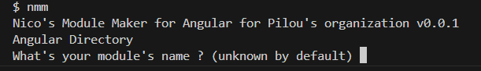
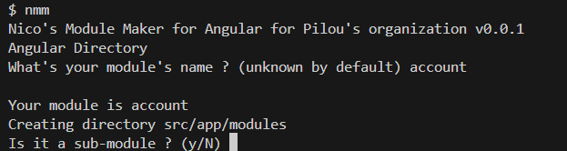
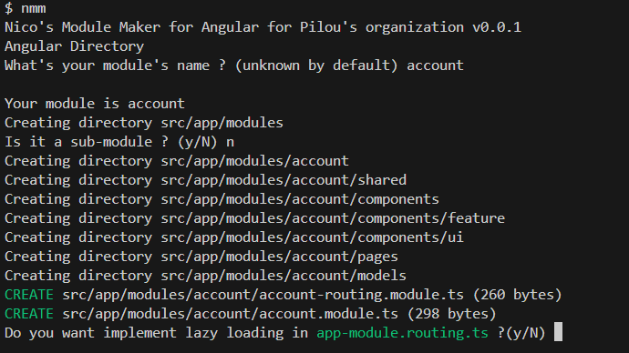
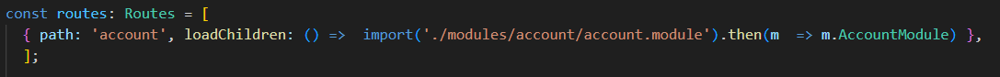

# angular-module
## Why ?
### Context
During my studies at Wild Code School, i learned to organized my Angular Projects in a certain way :
* modules contains directories :
 * shared -> services / business layer
 * components 
  * feature -> smart components
  * ui -> dumb components
 * models -> classes/interfaces/types
 * pages -> view components
* modules can contain sub-modules, organized in same way

### Observation
It would be boring to create always same directories

### Solution
Create a script to do automatically this directories...
In bash ?
I never do it !
Learn, try, learn and try !

## How install it ?
### One use
Copy the script in your project root.
Launch it with :
`
bash angular-module.sh
`

## How it works ?
Launch script.

First, it ask your module's name.

You could skip this step by add it after lauch command: `bash angular-module.sh account`

Script will ask you if it's a sub-module.

Y or y will be yes, by default other response will be no.

Yes or no, script creates directories and launch angular command :
`
ng g module modules/your-module --routing
`
Now, the lasy loading.

If you accept, your file app-routing-module.ts will be updated. 
**Note : lazy-loading for sub-modules isn't yet implemented** You would implement it manually.

